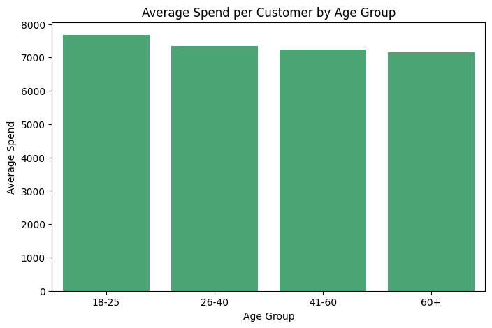

# Retail Transactions Data Analysis & Visualization

## Introduction
This project focuses on analyzing retail transactional data from a chain of stores operating across multiple cities in India. With the company expanding into Tier-2 and Tier-3 cities, understanding customer behavior, seasonal demand, and city-level sales performance has become essential. The raw dataset contains inconsistencies, missing values, and duplicates, making it challenging to extract insights directly. This project demonstrates how to clean, preprocess, and visualize such data to generate actionable business insights.

## Business Scenario
A retail chain wants to improve decision-making by analyzing customer purchase behavior. The AI team has tasked this project to preprocess and visualize transactional data, providing insights into customer preferences, sales trends, and revenue distribution across cities.

## Dataset
**Sample File:** `Retail_Transactions_2000.csv`  
The dataset contains 2000+ simulated transactions (full dataset 10,000+ records).  

**Columns include:**
- `TransactionID` – Unique ID for each transaction  
- `CustomerID` – Unique ID for customers  
- `Gender` – Male/Female/Other  
- `Age` – Customer age  
- `City` – City of purchase  
- `ProductCategory` – Category of product purchased  
- `Quantity` – Units purchased  
- `Price` – Price per unit (₹)  
- `TotalAmount` – Derived column (Quantity × Price)  
- `PurchaseDate` – Date of purchase  
- `PaymentMode` – Cash, Card, UPI, Wallet  

## Part A: Data Preprocessing
1. **Data Inspection**
   - Loaded the dataset and checked size, structure, and columns.  
   - Identified missing values, duplicates, and inconsistencies.  

2. **Handling Missing Data**
   - Replaced missing `Age` with mean.  
   - Replaced missing `City` with the most frequent value.  
   - Dropped rows with missing `TransactionID` or `ProductCategory`.  

3. **Data Cleaning**
   - Removed duplicate transactions.  
   - Standardized categorical values (e.g., 'm', 'Male', 'MALE' → 'Male').  
   - Corrected negative or zero values in `Quantity` and `Price`.  

4. **Feature Engineering**
   - Derived `TotalAmount` if missing.  
   - Extracted `Year`, `MonthName`, `DayOfWeek`, `DayName`, and `Date` from `PurchaseDate`.  
   - Created `AgeGroup` column: 18-25, 26-40, 41-60, 60+.  

5. **Encoding & Transformation**
   - Encoded categorical variables if needed.  
   - Optionally normalized numerical columns like `Age`, `Price`, and `TotalAmount`.  

6. **Final Verification**
   - Ensured no missing or invalid values remain.  
   - Saved cleaned dataset as `Retail_Cleaned.csv`.  

## Part B: Data Visualization
### Customer Demographics
- **Age Distribution:** Histogram  
- **Gender Distribution:** Pie chart  
- **Top 10 Cities by Customers:** Bar chart  

### Sales Insights
- **Total Sales by Product Category:** Bar chart  
- **Monthly Sales Trend:** Line chart  
- **Payment Mode Usage:** Pie chart  

### Advanced Insights
- **Average Spend per Customer by Age Group:** Bar chart  
- **City-wise Revenue Contribution:** Horizontal bar chart  
- **Heatmap:** Product category vs Payment mode showing total sales  

## Output Screenshots
- **Age Distribution:**
-   
- **Gender Distribution:**
-   
- **Top 10 Cities by Customers:**
-   
- **Total Sales by Product Category:**
-   
- **Monthly Sales Trend:**
-   
- **Payment Mode Usage:**
-   
- **Average Spend per Age Group:**
-   
- **City-wise Revenue Contribution:**
-   
- **Heatmap Product vs Payment Mode:**
-   

## Conclusion
This project demonstrates end-to-end preprocessing and visualization of retail transaction data. By cleaning and transforming the raw dataset, generating meaningful visualizations, and extracting advanced insights, we can:
- Understand customer demographics and preferences.  
- Track sales trends over time and across cities.  
- Identify revenue-contributing product categories and payment patterns.  
- Provide business-ready insights for inventory planning, marketing strategies, and decision-making.

The resulting clean dataset and visual dashboards equip management with actionable insights to improve business performance and customer engagement.
# TCS-DS
